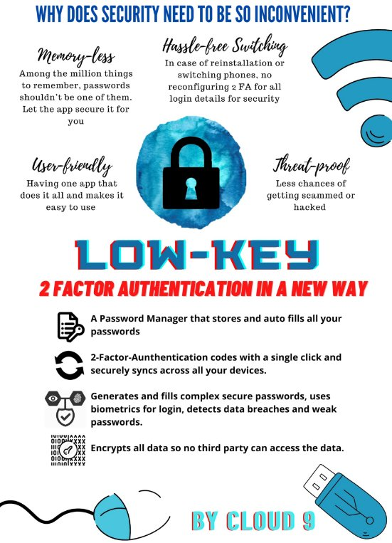
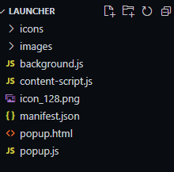

**LOWKEY**

**NATIONAL UNIVERSITY OF SINGAPORE**

**CP2106 (Orbital-Apollo)**

**CLOUD 9**

**MAYANK PANJIYARA**

**ANANYA GUPTA**

**2021**

**Poster**

**Motivation**

The main causes of data breaches these days are weak passwords. According to haveibeenpwned.com there are 11 Billion leaked accounts. Most of us keep using a maximum of 4-5 unique passwords which mostly contain our name, as that is all we can remember. A **password manager** solves this problem, it **stores all your passwords and auto fills them** for you, it also generates strong and **complex** passwords. So at the end of the day you just need to **remember 1 password**, that of the password manager. Sadly, most of the current solutions offer syncing between devices only for a monthly membership fee.

` `What if you have a strong password but the company gets breached and your password is **leaked**? This is where **2 Factor Authentication** (2FA) comes in, basically to log in you need a temporary code and your password, only your password is not enough to log you in, this is most common with banks where you require an OTP. 2FA codes **change every 30 secs** so hacking them is not an option. 2FA is an option on most sites but rarely used by people because of its **inconvenience**. Opening your phone then an app to see a code seems like too much work. Plus, if you **change your device** you lose everything and need to set up every login again. A way to **automate this process** would increase the adoption of 2FA and make the world a safer place.

**Aim**

Create an easy to use and robust password manager that autofills login details and 2FA keys. The password manager would be a browser extension that can be easily used by anyone.

**Codebase**

**Github repository : [https://github.com/mayankp291/lowkey**](https://github.com/mayankp291/lowkey)**

**App Tour**

`	`**[https://drive.google.com/file/d/1gmuxaIPh0kclCHRHpAyGnTN_8pK_qFfK/view?usp=sharing**](https://drive.google.com/file/d/1gmuxaIPh0kclCHRHpAyGnTN_8pK_qFfK/view?usp=sharing)**

**Deployment**
**

1) **Download the latest stable release from : [Google Drive**](https://drive.google.com/drive/folders/1K1Y5PG0RaoiOEhr64ojHJsv-UJJj7MC1?usp=sharing)**
1) **Turn on developer mode in chrome://extensions**
1) **Click on Load unpacked and select the dist folder downloaded in Step 1.**
1) **Login with the test account :** 
   1) **Username : noreply@example.com**
   1) **Password : password**

***(Disclaimer : DO NOT put an actual login credential in the extension, the app is only for testing and development purposes)***

**How are we different ?** 

1. **Syncing across devices**

Most of the current password managers that offer this option are paid and the free ones are often laggy and have a cap on number of passwords to store

1. **2FA client integrated with password manager**

Some password managers like Lastpass and 1Password offer it under their premium membership. Our product offers it for free.

1. **Syncing of 2FA credentials**

The two biggest apps in 2 factor authentication – Google Authenticator and Microsoft Authenticator offer no option for a cloud backup/sync, hence if you change devices the codes are wiped out and you are left stranded and you cannot login anywhere. Our solution syncs everything so you never lose your credentials.

**Tech Stack**

1. **Vue.js (frontend and integration)**
1. **Google Firebase (authentication and data storage)**

**Dependencies used**

1. **tailwindcss**
1. **autoprefixer**
1. **core-js**
1. **firebase**
1. **git**
1. **speakeasy**
1. **vue**
1. **vue-router**
1. **vuex**
1. ` `**vuex-webextensions**
1. ` `**buttercup/locust**
1. ` `**babel**
1. ` `**Vue-cli-plugin-browser-extension**

**User Stories**

1. As a forgetful user, I can store my logins in a password manager, so that I do not have to remember them.

1. As a user who uses the same password everywhere, I can create strong passwords, so that my accounts are safer.

1. As a student who has many passwords, I can save them on lowkey, so that I can access them anywhere.

1. As a user who feels 2 Factor inconvenient, I can quickly access them when I need them, so I don’t have to use multiple apps.

1. As a user who frequently uses 2 Factor Authentication frequently, I can save them, so that I can quickly fill it in a website.

**File Structure**

`	`**Vue Project**

**	lowkey                        

├─ dist                       

│  ├─ icons                   

│  │  ├─ 128.png              

│  │  ├─ 16.png               

│  │  ├─ 19.png               

│  │  ├─ 38.png               

│  │  └─ 48.png               

│  ├─ js                      

│  │  ├─ 0.js                 

│  │  ├─ 1.js                 

│  │  ├─ 2.js                 

│  │  ├─ 3.js                 

│  │  ├─ 4.js                 

│  │  ├─ about.js             

│  │  ├─ background.js        

│  │  ├─ chunk-vendors.js     

│  │  ├─ content-script.js    

│  │  └─ popup.js             

│  ├─ \_locales                

│  │  └─ en                   

│  │     └─ messages.json     

│  ├─ favicon.ico             

│  ├─ index.html              

│  ├─ manifest.json           

│  └─ popup.html              

├─ public                     

│  ├─ icons                   

│  │  ├─ 128.png              

│  │  ├─ 16.png               

│  │  ├─ 19.png               

│  │  ├─ 38.png               

│  │  └─ 48.png               

│  ├─ \_locales                

│  │  └─ en                   

│  │     └─ messages.json     

│  ├─ browser-extension.html  

│  ├─ favicon.ico             

│  └─ index.html              

├─ src                        

│  ├─ assets                  

│  │  ├─ logo.png             

│  │  └─ tailwind.css         

│  ├─ components              

│  │  ├─ AppHeader.vue        

│  │  ├─ HelloWorld.vue       

│  │  └─ heroslist.vue        

│  ├─ content-scripts         

│  │  └─ content-script.js    

│  ├─ popup                   

│  │  ├─ App.vue              

│  │  └─ main.js              

│  ├─ router                  

│  │  └─ index.js             

│  ├─ store                   

│  │  └─ index.js             

│  ├─ views                   

│  │  ├─ Settings.vue            

│  │  ├─ AddLogin.vue         

│  │  ├─ Edit.vue             

│  │  ├─ Genarator\_old.vue    

│  │  ├─ Generator.vue        

│  │  ├─ Home.vue             

│  │  ├─ Login.vue            

│  │  ├─ Testing.vue          

│  │  └─ Vault.vue            

│  ├─ background.js           

│  ├─ index.css               

│  └─ manifest.json           

├─ babel.config.js            

├─ firebase.js                

├─ key.pem                    

├─ LICENSE                    

├─ package-lock.json          

├─ package.json               

├─ postcss.config.js          

├─ README.md                  

└─ vue.config.js  

**	

`	`**Compiled Web Extension**

**	dist                     

├─ icons                 

│  ├─ 128.png            

│  ├─ 16.png             

│  ├─ 19.png             

│  ├─ 38.png             

│  └─ 48.png             

├─ js                    

│  ├─ 0.js               

│  ├─ 1.js               

│  ├─ 2.js               

│  ├─ 3.js               

│  ├─ 4.js               

│  ├─ about.js           

│  ├─ background.js      

│  ├─ chunk-vendors.js   

│  ├─ content-script.js  

│  └─ popup.js           

├─ \_locales              

│  └─ en                 

│     └─ messages.json   

├─ favicon.ico           

├─ index.html            

├─ manifest.json         

└─ popup.html 

** 

**Architecture Diagrams**

**Project Scope**

Explanation of the features and our logic and implementation behind them.

**Milestone 1 - Learning the Tech Stack** 

1. **Learning JavaScript, HTML and CSS**

Learn the basic definitions and syntax of the languages using Educative and Youtube.

Also, learnt API calls, async programming and basic web development. Decided to use tailwindCSS because of its ease of use and simple syntax and the ability to create beautiful responsive designs.

1. **Developing a Sample Login System** 	

Developed a simple login webpage running on the local server using ReactJs and mySQL Server. The application was made for us to implement and test the knowledge we had learnt over that period. The mySQL server also ran on the local machine. The application helped us understand frontend and backend processes and the login system and database querying was used in later parts of the project.

1. **Browser Extension Basics** 

Learned the basics of developing a browser extension and understanding the core requirements and working with the browser. 

The core requirements included : 

- manifest.json : A file that has the basic info about the extension including icons, default popup page and permissions required by the extension. The file enables the browser to process the extension.
- Popup.html : The page that is displayed when the extension is clicked
- Background.js : The javascript file that is always active on the background of the browser.
- Content-script.js : The javascript file that is used for injecting code and making changes to the DOM tree of the rendered webpages.

**Milestone 2**

1. **Choosing a Framework**	

**Vue 3** was chosen as the framework of choice due to its structured single file design (.vue) which allows HTML, CSS and JS to be written in a single file and  vuex features like mutations and states which allowed us to have a modular and streamlined program while not sparing on speed and security. The easier learning curve and extensive documentation were also important aspects.

1. **Dependencies to convert Vue web app to extension**

Building a vue project results in a web application, to create the files necessary for a browser extension dependencies [**"vue-cli-plugin-browser-extension"](https://github.com/adambullmer/vue-cli-plugin-browser-extension#readme)** and [**"vuex-webextensions"](https://github.com/MitsuhaKitsune/vuex-webextensions#readme)** were used. 

The **"vue-cli-plugin-browser-extension"** is a cli tool to create a customized boilerplate vue project for web extension development. The plugin changes the **serve** command for the vue application and removes the entrypoint of **src/main.js**. It creates a **dist** directory with all the required files and also adds live reload functionality, so we can make changes without refreshing the extension in browser settings. The plugin also adds files for **background** and **content script** functionality.

The **"vuex-webextensions"** plugin is a NodeJS module to use Vuex on WebExtensions in a “shared” context to start several instances of Vuex store and keep them synchronized through WebExtensions messaging API. The **Vuex** store is used as a secure and better alternative to having global variables and to have shared functions across components. Vuex does not work natively for web extensions, the plugin adapts the vuex store for web extensions.

1. **Firebase as backend**

**Google’s Firebase** services are used for Authentication and Data Storage syncing. Firebase was used as the caps it provides are sufficient for our use case of building a test app. The API is also very well documented and easy to use. Authentication is also handled by Firebase. We currently only have one user to simplify testing and development for us. As the app is just a test product for Orbital, the security is not upto standard of a commercial application (*refer to security and limitations for more details…*).

1. **Login Page/ Authentication**

User login and registration is the first page displayed when a user installs the extensions and opens it for the first time. The **stay signed in** option keeps the user signed in the next time the browser is opened (only recommended if the user trusts the security of their system). **Currently only one user is added to the database, this makes the testing process much easier for us and testers as the suite is already configured with multiple logins.**

1. **Vault**

After signing in, the user is brought over to the Vault. It contains all the credentials added by the user in a simple to read manner. Clicking the login autofills the details seamlessly to the webpage (autofill was added in milestone 3).

1. **CRUD Operations/ API**

The vault tab contains all the logins, functions of copying, editing, deleting and adding can be done using the buttons (pro tip : hovering over buttons shows their function). The vault info is stored in cloud firestore.

1. **Password Generator**

The password generator icon is located on the bottom navigation bar. It has all the options to create a strong and safe password, the created password can be copied to clipboard by clicking anywhere in the “generated password field”.

1. **Testing**

**Regression Testing**

Regression testing was done to ensure all features worked as intended. It was also done after every code commit to ensure nothing is broken and unnecessary bugs are not introduced in the application.

|Test No.|Objective|Steps Taken|Expected Result|Result|
| :- | :- | :- | :- | :- |
|
1

**Login**

**Tests**
|Test Login|
1. Extension Opened

2. Username and password entered

3. Stay Signed in

4. Click login
|Login is successful, logged in to homepage|Pass|
|2|Test Stay Signed in|
1. Open Extension

2. Homepage should be shown
|Stay signed in works|Pass|
|
3

**Password**

**Generator**
|
Test Password Generator

(All options)
|
1. Navigate to Generator

2. Set a length

3. Select all options

4. Click generate password

5. Password should be generated

6. Clicking on password copies it
|The copied password should contain uppercase, lowercase, symbols and numbers|Pass|
|4|
Test Password Generator

(Only lowercase and uppercase)
|
1. Navigate to Generator

2. Set a length

3. Select only lowercase and uppercase

4. Click generate password

5. Password should be generated

6. Clicking on password copies it
|The copied password should only contain lowercase and uppercase.|Pass|
|5|
Test Password Generator

(No options)
|
1. Navigate to Generator

2. Set a length

3. Select no options

4. Click generate password

5. Password should be generated

6. Clicking on password copies it
|The copied and generated password should be blank.|Pass|
|
6

**Vault**
|
Test

Adding login
|
1. Navigate to Vault

2. Click on Add

3. Enter username, password, website and totp secret

4. Click Add
|The login should be saved and visible in vault. The user should be returned to the vault page after being done.|Pass|
|7|Test Autofill|
1. Open a sample login page

2. Navigate to Vault

3. Click on a login
|The login details (username, password) should be autofilled into the website.|Pass|
|8|Test Copy Username|1. Click on “copy username” icon of a login.|The username should be copied to the clipboard.|Pass|
|9|Test Copy Password|1. Click on “copy password” icon of a login.|The password should be copied to the clipboard.|Pass|
|10|
Test Copy

TOTP Token
|1. Click on “copy TOTP” icon of a login.|The token should be copied to the clipboard.|Pass|
|11|Test Edit|
1. Click on “edit” icon of a login.

2. Change the field values.

3. Click on update.
|The details should be updated in the database and vault and the user should be returned to the vault.|Pass|
|12|Test Delete|1. Click on “delete” icon of a login.|The login should be deleted from the database.|Pass|

**Milestone 3**

1. **Autofill Login Details** 

Details can be autofilled in the website by just clicking the desired credential in the vault. 

The feature is handled by the [**buttercup/locust**](https://github.com/buttercup/locust) API. The API searches the DOM of the website for common form elements and returns *targets* which can be used for automating logins. The login info is then filled using the function **getLoginTarget().enterDetails()** which fills the details but does not submit it. The above mentioned function runs in our content script and an event listener triggers it if the user clicks on a login from the vault. 

1. **2FA token generation**

Two factor tokens can be copied by clicking on the “lock” icon for saved logins on the vault page. Currently our extension does not provide a way to know when the 2FA token expires, if the token doesn’t work its likely that its expired, in that case please copy the token again. 

Two Factor tokens are **only** available for logins where the user had provided **TOTP secret** while adding the login in the vault. 

1. **Bugs fixes : Stay signed in**

A bug where the stay signed in feature won’t work was fixed. 

**Limitations and Security**

**Unencrypted Local Storage**

The web extension uses **chrome.localstorage to store data** points and pass variables between frontend and backend. The l**ocalstorage is unencrypted and can be accessed by anyone** using the computer. **We do it only for functions where variables need to be stored locally or passed on to background.js or content-script.js from the vue frontend.** 

A **better way** of passing the variables between components would be using a **central store like redux or vuex**, we have **used vuex for the vue frontend** but it is **not supported by the extension** to communicate between the browser and frontend. 

**Another solution** would be to **encrypt the files** while storing and **decrypt** them while reading them. We did not go that route, considering that the extension is just a test development product and not built for actual use.

**Cloud Storage**

The login credentials are stored in google firestore database. However, **the stored data is not hashed or encrypted and can be leaked if someone manages to access the firebase database**. A hack is highly unlikely considering google’s security standards. The developers with access to the database can also view the credentials. 

A solution to this would be hashing or encrypting all the data and link the key with the user’s account to store it in another database. This makes sure if someone gets access to the database they cannot get access to any sensitive information. Again, this not being a commercial product we did not go that route.

**Software Engineering Practices**

**Git**

We used github for proper code management and organisation. All the code changes were **tested before committing and pushing** to github. We only committed to the master branch, this ensured that each of us were fairly confident in our code before pushing. We made sure to properly review our codes while merging.

**Trello**

We used Trello to track our performance and to organise our work. It allowed us to have a clear line of thought and do things in a relatively productive manner. The cards were divided into 3 rows - **TO DO, IN PROGRESS and COMPLETED.** All of our ideas were first fed into TO DO, then whichever of us is free at the time picks the card and moves it to PROGRESS and at last into COMPLETED. This ensured that each of us did an equal amount of work and the work done by one can be easily tracked in case a bug occurs.

**Response to Evaluations**

**We thank all for taking out the time to give us constructive and valuable feedback, we have tried our utmost best to implement them and improve our product.** Below is a compiled list of feedback and our responses to them. We are extremely sorry if we were not able to accommodate some of the suggestions due to the short time frame of Orbital.

**Milestone 1**

***Suggestion : Could improve on user interface and think about the program flow such that users do not have a hard time navigating the website. Looking forward to more robust features and code examples for your frontend and backend side!***

Response : The initial login system was just a test project for us to implement our knowledge to build a Proof of Concept. At the time we were confused and looking at either to do a web app, extension or phone app and hence we didn’t have a proper user interface and design. This was solved in further milestones.

***Suggestion : For the tech POC, would've been great if we could see the chrome extension. (If doing both a chrome extension and webapp is too demanding, just cut the chrome extension. Arrange a consult w me if you need help scoping your project.)***

***You can simplify your webapp development by using pre-made components like Material UI.***

***Otherwise, no problems! What you've submitted thus far definitely meets the programme requirements! Great work!***

***Some pointers for improvement:***

***(1) Write better user stories - https://nus-cs2103-ay2021s2.github.io/website/se-book-adapted/chapters/specifyingRequirements.html#user-stories***

***There is a "correct format" to write user stories. Ideally, you break down your big features into smaller groups of user stories (called "epics"), and then within each epic, break down the feature into super small and minute user stories. These small and minute user stories can then be used as a "to-do" for you to check things off as you develop new features. You can then make use of a type of board called Kanban Board to organise these user stories to plan out your project. GitHub has these https://docs.github.com/en/issues/organizing-your-work-with-project-boards/managing-project-boards/about-project-boards, or you can use Trello, Asana, etc.***

***(2) Have more technical documentation: A good start will be to have an architecture diagram to show how different parts of your stack interact with each other. Architecture diagrams are good to start with because they are free-form diagrams (there are no conventions to follow, unlike UML in class diagrams). https://nus-cs2103-ay2021s2.github.io/website/se-book-adapted/chapters/architecture.html***

***Tools that I recommend to draw diagrams: LucidChart (collaborative, have free pro account for students), Draw.io***

***Keep it up! Let me know if you need any help!***

Response : Thanks for the suggestion, we ended up doing only the web extension as that felt to us to be the most useful and accessible component for a password manager. We will try to improve our user stories and add architecture diagrams for the next milestone.  

***Suggestion : The problem is well defined and articulated, and the solution is very relevant and solves the important aspects of the problem. However, I feel the target audience can be more well defined (specifically who exactly it targets is not mentioned). Moreover, though I see a problem and can relate to it, I am not sure if it really needs to be solved considering the fact that many websites don't allow users to set a weak password by default. Nevertheless, the project solution solves the important aspects of the problem.***

Response : According to us the target audience for this was anyone who uses a computer and hence we had problems defining the target audience. We have taken the suggestion and will surely improve it for later milestones.

***Suggestion : The project log, poster as well as the video are well presented. The README covers all the required points. The only thing that I felt could have been done better, is that the target audience could be more well defined and the 'how are we different from similar apps?' section could be more convincing. The current target audience is too broad.***

Response : This one is again very similar to the above question.Yes, the current target audience seemed too broad and we didn’t do a good job of defining it clearly.

**Milestone 2**

***Suggestion : A video on how the app works would be better, rather than just talking about the need to have this mobile application for people who use many passwords. The poster looks similar for both milestone 1 and 2, and there are also no changes to the video. There should be updates on the video to show us how the app looks like, and if there are any differences/changes made in terms of target audience or purpose of the app from Milestone 1 to Milestone 2. The README does have screenshots of how the app looks but if there were videos showcasing the app, that would be better as well.***

Response : Yes, we certainly agree with this. The app at the time was a work in progress and we were constantly adding features and felt making a video would seem incomplete at the time. We did make a video for milestone 3.

***Suggestion : The team did not submit any videos regarding user testing.***

Response : The testing we had done didn’t feel sufficient for us to submit a video. We will however try to upload in depth testing videos for further milestones. 

***Suggestion : The main features are seen in the form of screenshots under the README file, and looks quite intuitive. However, a video walkthrough of the app should have been made to showcase the app's features for us to know it better, and for us to rate whether the features are acceptable.***

Response : The answer for this is similar to the video suggestion above, we had this as a priority for the next milestone as multiple teams had requested us this.

***Suggestion : Poster is well done but maybe the video can speak slower.***

Response : Sure, will do.

***Suggestion : Maybe have a video of a user actually using the extension would be nice.***

Response : Yes, we totally agree. We will post an in-depth video regarding the usage in milestone 3 as we inch closer to have a complete and final product.

***Suggestion : I feel that the README section can be more comprehensive (it can elaborate more on each of the features, their functionality and how exactly the users can navigate through the application). The poster is designed well. The log is very comprehensive and video is also clear.***

Response : We whole-heartedly agree with this, for the earlier milestones were more concentrated in developing our app rather than writing good and in-depth documentation. We will try to post a more well-documented product for the next milestone.

***Suggestion : They could have tried unit testing, which is more comprehensive. I also feel they could have evaluated the suitability of their solution by letting other users try their product and interview them. Otherwise I feel their current testing method effectively shows that their features work as intended*** 

Response : We had done unit testing in the form of regression testing in milestone 2 but we didn’t include it in the README. We will try to include our methodology for milestone 3.

***Suggestion : I believe the team has clearly and effectively specified all the features that have been implemented in this milestone as well as the features currently in development. The team has accomplished the necessary requirements for their current aimed level of achievement (with respect to project implementation and depth). If there is one thing they could have done differently, it would be elaborating each of the features in a greater depth (rather than merely stating them with little explanation).***  

Response : We agree that we had not explained the features much in detail. Until milestone 2 we had skimped on the README and focused most of our time on the software itself, we have tried to do a better job for milestone 3.

***Suggestion : more user testing will help with the user interface and user experience.***

Response : We have got multiple requests for User Acceptance Testing and we have made efforts to include it for milestone 3.

***Suggestion : Your technical documentation is quite lacking. There is also a missing section on "testing" - either user tests or system testing, which is part of the programme requirements for Orbital.***

***Otherwise the password manager looks good.***

***As for your technical documentation: I've already raised this up in milestone 1 but your user stories are still wrong. Please read my comments. Copy pasting here for reference.***

***Some pointers for improvement:***

***(1) Write better user stories - https://nus-cs2103-ay2021s2.github.io/website/se-book-adapted/chapters/specifyingRequirements.html#user-stories***

***There is a "correct format" to write user stories. Ideally, you break down your big features into smaller groups of user stories (called "epics"), and then within each epic, break down the feature into super small and minute user stories. These small and minute user stories can then be used as a "to-do" for you to check things off as you develop new features. You can then make use of a type of board called Kanban Board to organise these user stories to plan out your project. GitHub has these https://docs.github.com/en/issues/organizing-your-work-with-project-boards/managing-project-boards/about-project-boards, or you can use Trello, Asana, etc.***

***(2) Have more technical documentation: A good start will be to have an architecture diagram to show how different parts of your stack interact with each other. Architecture diagrams are good to start with because they are free-form diagrams (there are no conventions to follow, unlike UML in class diagrams). https://nus-cs2103-ay2021s2.github.io/website/se-book-adapted/chapters/architecture.html***

***Tools that I recommend to draw diagrams: LucidChart (collaborative, have free pro account for students), Draw.io***

Response : We are sorry that we didn’t put enough effort for technical documentation until milestone 2, we had decided to put most of our time towards software development. We have made efforts to solve this issue in milestone 3 and believe its much better compared to previous milestones.

***Suggestion : You can try conducting some user tests (i.e. ask your friends to use it and get their comments). You can also do system testing like writing unit tests.***

Response : We plan to include User Acceptance Testing in Milestone 3 after multiple requests and suggestions.

**Project Log**

|**S/N**|**Task**|**Date**|**Orbitee 1: Mayank (hrs)**|**Orbitee 2: Ananya (hrs)**|**Details/Remarks**|
| :- | :- | :- | :- | :- | :- |
|**1**|**Liftoff Day 1**|**10th May 2021**|**8**|**8**|**Liftoff Day 1**|
|**2**|**Liftoff Day 2**|**11th May 2021**|**8**|**8**|**Liftoff Day 2**|
|**3**|
**Team meeting & initial**

**planning**
|**12th May 2021**|**2**|**2**|**1) Layout for idea and framework set for working**|
|**4**|
**Team meeting:**

**Implementation details and**

**initial project structure**
|**16th May 2021**|**4**|**4**|
**1) Discussed implementation features**

**2) Begin to create project structure and finalising poster & video**
|
|**5**|**Mission control**|**17th May 2021**|**1**|**3**|**Finalising poster submission and review of it**|
|**6**|**Programming at home: Chrome Extension**|**18th May 2021**|**4**|**3**|**Basic Chrome extension for autofill password**|
|**7**|**Programming at home: Chrome Extension Error debugging**|**20th May 2021**|**3**|**5**|**Debugging erroneous code and loading it**|
|**8**|**Programming at home: Chrome Extension Finalising**|**21st May 2021**|**1**|**2**|**Final run and setup for extension**|
|**9**|**Programming at home: Password Manager Framework**|**22nd May 2021**|**3**|**2**|**Discussing the working requirements for password manager**|
|**10**|**Programming at home: Password Manager Building**|**24th May 2021**|**4**|**5**|
**1) Develop database to handle simple passwords**

**2) Developed skeleton of the system to store it**
|
|**11**|**Programming at home: Password Manager Building**|**25th May 2021**|**7**|**5**|
**1) Develop database to handle complex passwords**

**2) Developed storing section**
|
|**12**|**Programming at home: Password Manager Building**|**27th May 2021**|**2**|**5**|**Develop database to store passwords**|
|**13**|**Programming at home: Password Manager and Chrome Extension**|**29th May 2021**|**1**|**2**|**Check run for both**|
|**14**|**Final Review**|**30th May 2021**|**4**|**2**|**Final review and run**|
|**15**|**Team Meeting: Milestone 1 Submission**|**31st May 2021**|**1**|**1**|**Worked on Milestone 1**|
|**16**|**Team meeting & planning**|**2nd June 2021**|**4**|**4**|**Planning for revisions in the program**|
|**17**|**Programming at home: Features in program**|**4th June 2021**|**7**|**4**|**Login system frontend**|
|**18**|**Programming at home: Features in program**|**7th June 2021**|**8**|**5**|**Implemented login feature using firebase**|
|**19**|**Programming at home: Password Generator**|**9th June 2021**|**7**|**6**|**Password Generator**|
|**20**|**Programming at home: Password Generator**|**10th June 2021**|**5**|**4**|**Password Generator, improved styling**|
|**21**|**Programming at home: Vue router**|**15th June 2021**|**5**|**5**|**Add router paths**|
|**22**|**Programming at home: CRUD operations**|**17th June 2021**|**6**|**5**|**Add new login**|
|**23**|**Programming at home: CRUD operations**|**18th June 2021**|**5**|**5**|**Delete and View**|
|**24**|**Programming at home: CRUD operations**|**20th June 2021**|**9**|**5**|**Edit and copy, fix sync issues with firebase**|
|**25**|**Programming at home: Content Scripts**|**23rd June 2021**|**6**|**4**|**Learning about content scripts and implementation**|
|**26**|**Programming at home: Improve styling**|**25th June 2021**|**5**|**3**|**Improved styling of the extension and cleaned up code**|
|**27**|**Final Review**|**27th June 2021**|**4**|**2**|**Final review and run**|
|**28**|**Team Meeting: Milestone 2 Submission**|**28th June 2021**|**2**|**2**|**Worked on Milestone 2**|
|**29**|**Implement local storage using Chrome API**|
**1st**

**July**

**2021**
|` `**5**|` `**4**|**Used localstoragesync to sync details with all accounts**|
|` `**30**|**Fix the logout bug**|
**3rd**

**July**

**2021**
|` `**4**|` `**3**|**The user would log out everytime the extension is closed**|
|**31**|**Tighter integration with chrome using Chrome API**|
**6th**

**July**

**2021**
|**6**|**5**|**Using content scripts and background files**|
|**32**|**Adding Autofill using Locust API**|
**9th**

**July**

**2021**
|**6**|**4**|**Autofill login details by clicking the login**|
|**33**|` `**Fixing styling issues**|
**12th**

**July**

**2021**
|` `**3**|` `**4**|` `**Fixed minor styling issues**|
|**34**|**Adding Speakeasy APi for 2FA token generation**|
**15th July**

**2021**
|**7**|**5**|**Implement the API and testing**|
|**35**|**Milestone 3 report**|
**20th July**

**2021**
|**3**|**3**|**Make the milestone 3 report**|
|**36**|**Milestone 3 report**|
**22th July**

**2021**
|**4**|**3**|**Editing and adding more details**|
|**37**|**Finalise and submit Milestone 3 report**|
**25th July**

**2021**
|**5**|**4**|**Submit the report**|
|||||||
|** |**Total Hours**|**312**|** |** |** |
|** |**Ananya (Orbitee 1)**|**161**|** |** |** |
|** |**Mayank (Orbittee 2)**|**151**|** |** |** |
|** |** |** |** |** |** |

